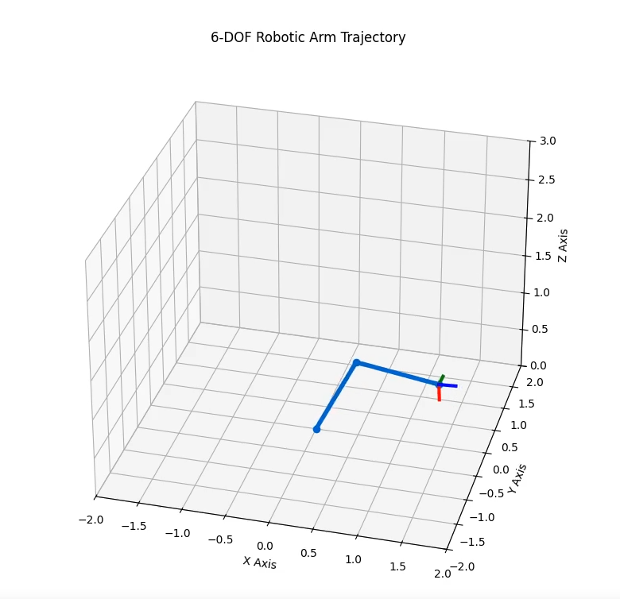

# 6-DOF Robotic Arm Kinematics and Trajectory Planning Simulator

This advanced robotics project implements a full 6-Degree-of-Freedom (6-DOF) robotic arm simulation in Python. The core of the project is a numerical inverse kinematics (IK) solver that can determine the required joint angles to achieve both a specific end-effector position `(x, y, z)` and a target orientation (roll, pitch, yaw).

<em>Click the image above to watch the MP4 video of the full 6-DOF simulation.</em>

## Key Concepts & Features

This simulation demonstrates a range of concepts critical to modern robotics:

1.  **Full 6-DOF Kinematic Chain:** The arm is modelled as a 3-DOF regional manipulator (base, shoulder, elbow) combined with a 3-DOF spherical wrist, creating a full 6-DOF system capable of reaching any point and orientation within its workspace.

2.  **Homogeneous Transformation Matrices:** The mathematical foundation of the model. 4x4 matrices are used to represent the rotation and translation of each joint, allowing the entire kinematic chain to be calculated via matrix multiplication.

3.  **Inverse Kinematics via Numerical Optimization:** Instead of a complex closed-form solution, the IK problem is solved using the `scipy.optimize.minimize` function. This approach is highly flexible and powerful.

4.  **Combined Position & Orientation Error:** The optimizer's objective function calculates a weighted error based on both the Cartesian distance to the target position and the angular distance (in radians) to the target orientation.

5.  **Continuous Trajectory Solving:** To avoid "solution flipping" between different valid arm configurations, the IK solver for each point in a trajectory is seeded with the solution from the previous point, ensuring a smooth and logical motion path.

6.  **Spherical Linear Interpolation (Slerp):** To generate smooth rotational motion, the orientation of the end-effector is interpolated between a start and end pose using SciPy's Slerp algorithm, which is the standard for correctly handling 3D rotations.

## Technologies Used
* Python
* NumPy
* Matplotlib (for 3D plotting and animation)
* SciPy (for numerical optimization and spatial transforms)
* Jupyter Notebook

## How to Run
1.  Clone this repository.
2.  Create a Conda environment and install the dependencies from `requirements.txt`.
3.  Launch Jupyter Notebook and open the `.ipynb` file.
4.  Run the cells sequentially to see the calculations and the final animation.
